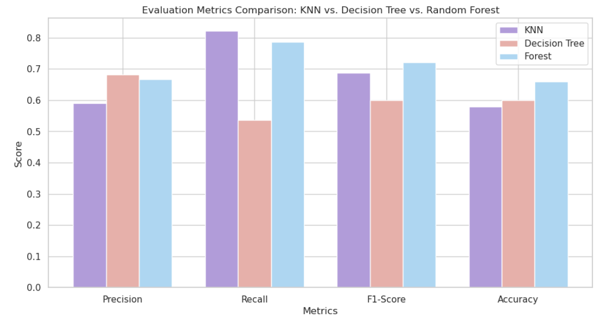
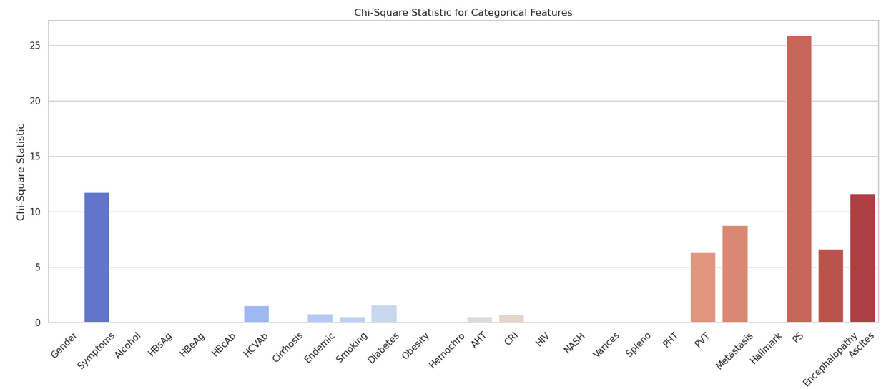

# 2º Assignment - Artificial Intelligence and Data Science Pipeline 

The second practical assignment consists in the development of a full data science pipeline, from exploratory
data analysis and data preprocessing to the application of supervised learning techniques for classification and
their respective performance evaluation. Optionally, the project may also consider the exploration of additional
techniques such as clustering, missing or imbalanced data handling, among others, to improve the system’s
performance.

## The Hepatocellular Carcinoma Dataset
In this project, the goal is to address a real data science use case from data cleaning and feature assessment to
visual inspection and communication of results, using the Hepatocellular Carcinoma (HCC) dataset. The HCC
dataset was collected at the Coimbra Hospital and University Center (CHUC) in Portugal and contains real
clinical data of patients diagnosed with HCC. The main goal of this project is to develop a machine learning
pipeline capable of determining the survivability of patients at 1 year after diagnosis (e.g., “lives” or “dies”).






## Prerequisites to run the project
- Python (version 3.7 or higher recommended)
- `pip` (Python package installer)

## Setting Up the Environment
Setting Up the Environment
Creating a Virtual Environment (Recommended)

A virtual environment isolates project dependencies, preventing conflicts with other Python projects on your system. Here's how to create and activate a virtual environment:

```sh
python -m venv env
```

To activate the virtual environment
```sh
source env/bin/activate  # For Linux/macOS
env\Scripts\activate.bat  # For Windows
```

To deactivate the virtual environment
```sh
deactivate
```

To delete virtual env
```sh
# Linux/macOS
rm -rf env

# Windows
rmdir /s /q env
```

### Step 2: Install the dependencies:

To download the dependencies, enter in virtual env and then run the following commands:

```sh
source env/bin/activate
pip install -r requirements.txt